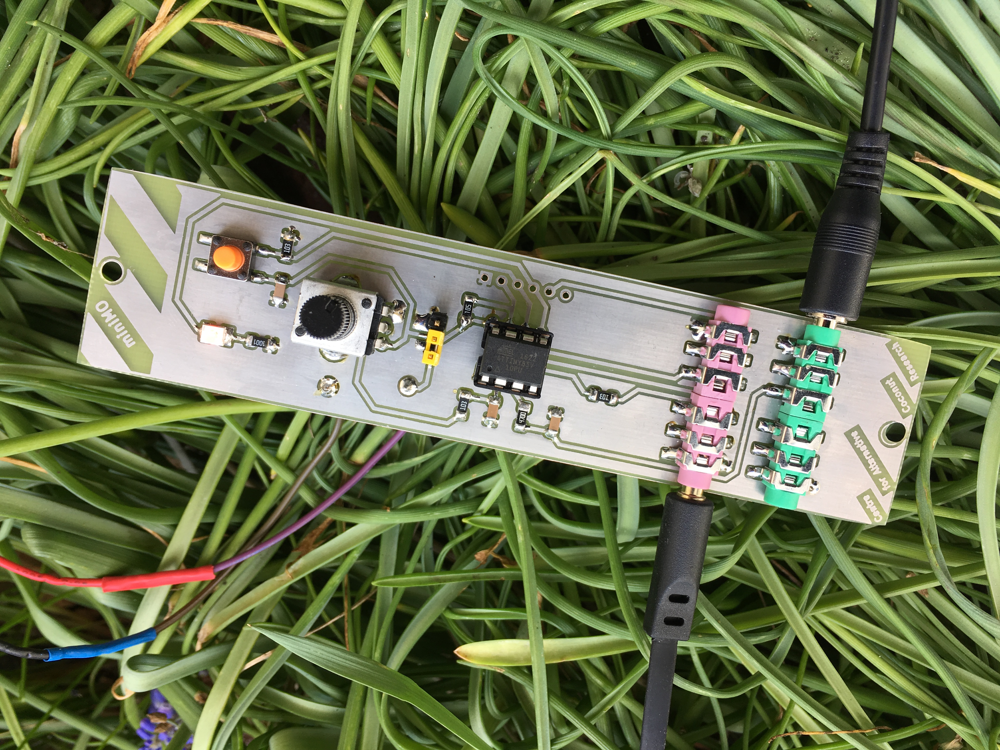
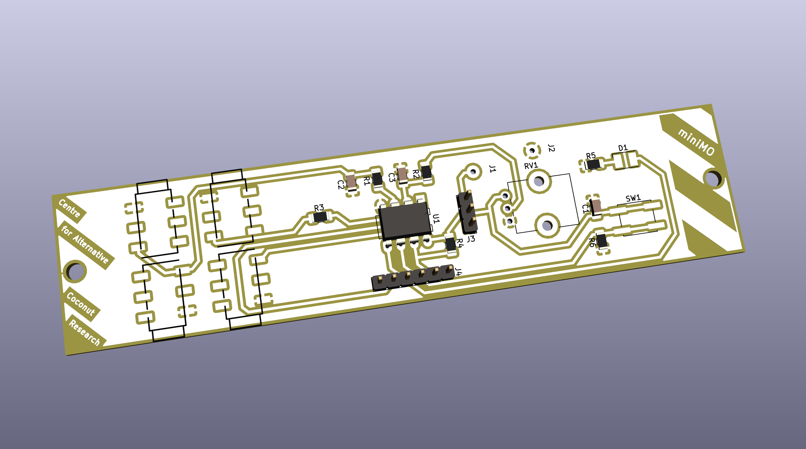

# tinyModular

## What is this project about?

This is a modular synthesizer built around the ATtiny microcontroller. All modules have identical hardware, and can be programmed to become oscillators, filters, noise generators, etc.

This project is based on the original miniMO by Jose Gonzalez. [minimosynth.com](https://minimosynth.com)

## Design goals for the first version

Edition One is my first attempt to create a [Eurorack](https://en.wikipedia.org/wiki/Eurorack) module based on the original miniMO. The goal was to create a module that can be quickly and easily built using DIY methods, on a single PCB, with as few as possible through hole components, no vias and without wiring. The schematic was redrawn from the original by Jose Gonzalez.

## Images

Here is an image of the first built module:

Here is a rendering of the PCB, with some components:

## PDFs

The PCB layout used for printing on transparency film:

(edition_one/pdf/tiny_modular_pcb.pdf)

The schematic:

(edition_one/pdf/tiny_modular_schematic.pdf)

## License

The tinyModular circuit is CC NC BY minimosynth.com