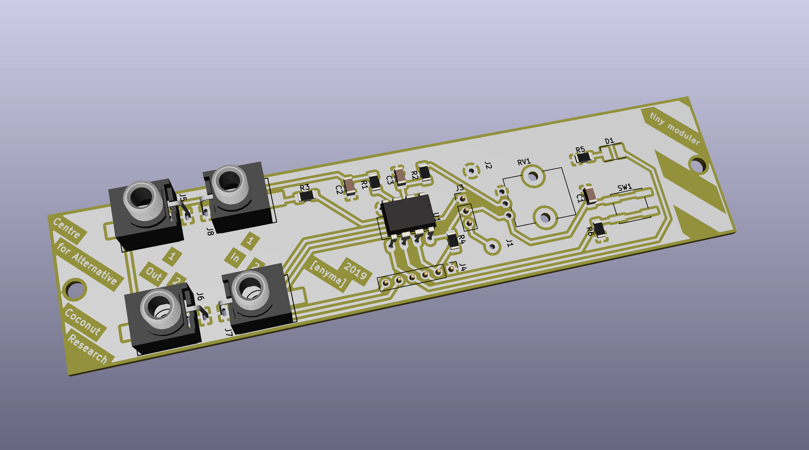

# tinyModular

## What is this project about?

This is a modular synthesizer built around the ATtiny microcontroller. All modules have identical hardware, and can be programmed to become oscillators, filters, noise generators, etc.

This project is based on the original miniMO by Jose Gonzalez: [minimosynth.com](https://minimosynth.com)

## Design goals for the first version

Edition One is my first attempt to create a [Eurorack](https://en.wikipedia.org/wiki/Eurorack) module based on the original miniMO. The goal was to create a module that can be quickly and easily built using DIY methods, on a single PCB, with as few as possible through hole components, no vias and without wiring. The schematic was redrawn from the original by Jose Gonzalez.

## Images

Here is an image of the first built module:

Here is a rendering of the PCB, with some components:

## PDFs

The PCB layout used for printing on transparency film:

[tiny_modular_pcb.pdf](edition_one/pdf/tiny_modular_pcb.pdf)

The schematic:

[tiny_modular_schematic.pdf](edition_one/pdf/tiny_modular_schematic.pdf)

## KiCad files

The schematic and layout were drawn in KiCad 5.0.2. You can find the project [in this directory](edition_one/kicad_5).

## Caveats

The 3.5mm jacks should be positioned perpendicular to the module front in order to be accessible, but there seems to be no jack on the market which can do this. A solution might be to add an auxiliary PCB for the jacks, soldered to the main PCB perpendicularly.

Pin 1 (J3) and pin 6 (J4) are still unconnected on this revision of the PCB. The idea is that pin 6 supplies power to the PCB when it is connected to a programmer with the jumper set for this on J3.

## License

The tinyModular circuit is CC NC BY minimosynth.com